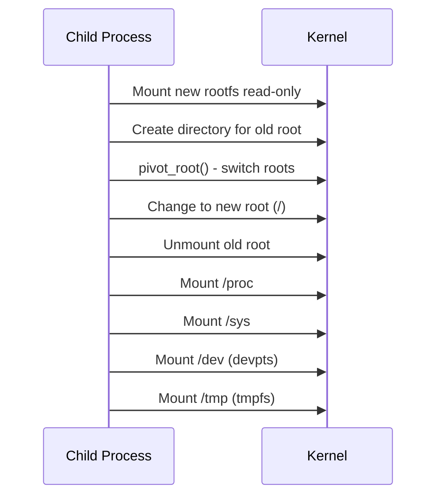

# nano-sandbox Architecture Overview

## What is nano-sandbox?

nano-sandbox is an **educational OCI-compatible container runtime** written in C. It demonstrates how container runtimes work by implementing the core OCI Runtime Specification with explicit, inspectable code. Unlike production runtimes that prioritize performance and feature coverage, nano-sandbox prioritizes **clarity, observability, and educational value**.

## Key Characteristics

- **~4,300 lines of C code** - Small enough to understand end-to-end
- **Explicit execution model** - Every step is logged and explainable
- **Production-quality structure** - Clean architecture, comprehensive tests
- **OCI Spec compliant** - Compatible with standard container tooling
- **Educational mode** - Built-in explanations of what's happening and why

## System Architecture

### High-Level Component Diagram

```mermaid
flowchart TB
    subgraph "User Interface"
        CLI[User/Docker/Containerd]
        SCRIPTS[Test Scripts]
    end

    subgraph "CLI Layer"
        MAIN[src/main.c<br/>CLI Parser & Orchestrator]
    end

    subgraph "Core Components"
        OCI[src/oci/spec.c<br/>OCI Spec Parser]
        STATE[src/common/state.c<br/>State Management]
        LOG[src/common/log.c<br/>Logging System]
    end

    subgraph "Container Execution"
        PROCESS[src/container/process.c<br/>Process Creation & Signals]
        NS[src/container/namespaces.c<br/>Namespace Setup]
        MOUNT[src/container/mounts.c<br/>Rootfs & Mounts]
        CGROUP[src/container/cgroups.c<br/>Resource Limits]
    end

    subgraph "Linux Kernel"
        KERNEL[clone() System Call]
        NAMESPACES[Namespaces]
        MOUNTS[Mount Tables]
        CGROUPS[cgroups v2]
        EXECVE[execve()]
    end

    subgraph "Storage"
        BUNDLE[(OCI Bundle<br/>config.json + rootfs)]
        STATE_FILES[(State Files<br/>/run/nano-sandbox/])]
    end

    CLI --> MAIN
    SCRIPTS --> MAIN
    MAIN --> OCI
    MAIN --> STATE
    MAIN --> LOG
    MAIN --> PROCESS

    OCI --> PROCESS
    STATE --> STATE_FILES
    BUNDLE --> OCI

    PROCESS --> NS
    PROCESS --> MOUNT
    PROCESS --> CGROUP

    NS --> KERNEL
    NS --> NAMESPACES
    MOUNT --> MOUNTS
    CGROUP --> CGROUPS

    KERNEL --> EXECVE
    EXECVE --> CONTAINER[Container Process]
```

## Component Deep Dive

### 1. CLI Layer (`src/main.c`)

**Purpose:** Entry point and command orchestration

**Responsibilities:**
- Parse command-line arguments with `getopt_long()`
- Validate command semantics (e.g., `start` requires `create` first)
- Route commands to appropriate handlers
- Manage lifecycle state transitions
- Emit user-facing logs

**Key Functions:**
- `main()` - Parse args, route to command handlers
- `nk_container_create()` - Create container metadata
- `nk_container_start()` - Start container process
- `nk_container_run()` - Create + start in one command
- `nk_container_delete()` - Cleanup and remove container
- `nk_container_state()` - Query container status

**Data Flow:**
```
CLI Args → Parse → Validate → Load State → Execute Command → Persist State
```

### 2. OCI Parser (`src/oci/spec.c`)

**Purpose:** Parse and validate OCI runtime spec

**Responsibilities:**
- Load `config.json` from bundle directory
- Validate required sections (process, root, linux)
- Build in-memory representation (`nk_oci_spec_t`)
- Provide structured access to spec data

**Supported OCI Spec Sections:**
- `process` - Args, env, cwd, user, capabilities, rlimits
- `root` - Rootfs path, readonly flag
- `mounts` - Mount points and options
- `linux` - Namespaces, cgroups, seccomp (partial)
- `annotations` - Key-value metadata

**Key Data Structures:**
```c
typedef struct {
    nk_process_t *process;
    nk_root_t *root;
    nk_mount_t **mounts;
    size_t mounts_len;
    nk_linux_t *linux;
    // ...
} nk_oci_spec_t;
```

### 3. State Management (`src/common/state.c`)

**Purpose:** Persist container lifecycle state

**State Location:**
- Root user: `/run/nano-sandbox/<container-id>/state.json`
- Non-root: `~/.local/share/nano-sandbox/run/<container-id>/state.json`

**State Transitions:**
```
INVALID → CREATED → RUNNING → STOPPED → DELETED
```

**State File Format (JSON):**
```json
{
  "id": "my-container",
  "bundle_path": "/path/to/bundle",
  "state": "running",
  "mode": "container",
  "pid": 12345
}
```

**Operations:**
- `nk_state_save()` - Persist state to disk
- `nk_state_load()` - Load state from disk
- `nk_state_delete()` - Remove state file
- `nk_state_exists()` - Check if container exists

### 4. Process Execution (`src/container/process.c`)

**Purpose:** Create and manage container processes

**Key Mechanism:** `clone()` system call (not `fork()`)

**Why clone()?**
- Namespace selection must happen at process creation
- Flags like `CLONE_NEWPID`, `CLONE_NEWNS` require `clone()`
- Fork can't add namespaces to existing process

**Parent-Child Synchronization:**
```
Parent                    Child
  |                          |
  |--- create pipe --------->|
  |                          |
  |--- clone() ------------->|
  |                          | (setup namespaces, rootfs)
  |<-- ready byte -----------|
  |                          |
  |--- save RUNNING state   |
  |                          |
  |                          |--- execve() --->
  |                          |
  |--- waitpid() ----------->| (runs until exit)
```

**Why Synchronization Matters:**
- Prevents parent from marking container RUNNING before it's ready
- Allows parent to detect child setup failures
- Avoids race conditions in state management

### 5. Namespace Setup (`src/container/namespaces.c`)

**Purpose:** Configure Linux namespaces for isolation

**Supported Namespaces:**
| OCI Namespace | Clone Flag | Isolation Provided |
|---------------|------------|-------------------|
| `pid` | `CLONE_NEWPID` | Separate process tree |
| `network` | `CLONE_NEWNET` | Separate network stack |
| `ipc` | `CLONE_NEWIPC` | Separate IPC mechanisms |
| `uts` | `CLONE_NEWUTS` | Separate hostname |
| `mount` | `CLONE_NEWNS` | Separate mount table |

**How It Works:**
1. Parse namespace list from OCI spec
2. Convert to `clone()` flags bitmask
3. Pass flags to `clone()` system call
4. Child process starts with isolated namespaces

**Example:**
```c
// PID + Network + IPC + UTS + Mount isolation
unsigned long flags = CLONE_NEWPID | CLONE_NEWNET |
                       CLONE_NEWIPC | CLONE_NEWUTS |
                       CLONE_NEWNS;

clone(child_fn, child_stack, flags, &ctx);
```

### 6. Mount Setup (`src/container/mounts.c`)

**Purpose:** Configure container root filesystem

**Key Operation:** `pivot_root()` - Switch root filesystem

**Mount Sequence:**


**Why pivot_root()?**
- `chroot()` doesn't work for containers
- Processes can escape chroot with `..`
- `pivot_root()` properly switches the root filesystem
- Required by OCI runtime spec

### 7. Cgroups (`src/container/cgroups.c`)

**Purpose:** Limit container resource usage

**Supported Limits:**
- **Memory** - Maximum memory usage
- **CPU** - CPU shares/quotas
- **PIDs** - Maximum process count

**cgroups v2 Hierarchy:**
```
/sys/fs/cgroup/
  └── nano-sandbox/
      └── <container-id>/
          ├── cgroup.type       # domain
          ├── memory.max        # memory limit
          ├── cpu.weight        # CPU shares
          └── pids.max          # process limit
```

**Operations:**
- Create cgroup directory
- Set resource limits
- Add container PID to cgroup
- Cleanup on container delete

### 8. Logging System (`src/common/log.c`)

**Purpose:** Structured, observable logging

**Log Levels:**
- `DEBUG` - Detailed execution info
- `INFO` - Normal operations
- `WARN` - Warning messages
- `ERROR` - Error conditions

**Role-Based Prefixes:**
```
[timestamp] [LEVEL] [ROLE] message
                       ^^^^
                PARENT/CHILD/HOST
```

**Educational Mode:**
```bash
ns-runtime -E create --bundle=/path/to/bundle mycontainer
```
Explains what's happening in plain language:
- "Why clone() is used instead of fork()"
- "What each namespace does"
- "How pivot_root works"

## Installation Layout

### System Install (`sudo make install`)
```
/usr/local/bin/
  └── nk-runtime                    # Binary

/usr/local/share/nano-sandbox/
  └── bundle/                       # Test bundle
      ├── config.json
      └── rootfs/
          ├── bin/
          ├── lib/
          └── ...

/run/nano-sandbox/
  └── <container-id>/
      └── state.json                # Container state
```

### User Install (`make install`)
```
~/.local/bin/
  └── nk-runtime

~/.local/share/nano-sandbox/
  └── bundle/

~/.local/share/nano-sandbox/run/
  └── <container-id>/
      └── state.json
```

## Design Principles

From `CLAUDE.md`, the project follows:

1. **Explicit over implicit** - No magic, all steps visible
2. **Observable by default** - Critical paths have logging
3. **Testable design** - Every component has tests
4. **Fail fast** - Clear error messages
5. **Minimal dependencies** - Only jansson (required), libcap-ng (optional)
6. **Educational first** - Code is meant to be learned from

## Comparison to Other Runtimes

| Feature | nano-sandbox | runc | crun | kata-containers |
|---------|--------------|------|------|-----------------|
| OCI Spec | ✅ Full | ✅ Full | ✅ Full | ✅ Full |
| Educational Mode | ✅ Yes | ❌ No | ❌ No | ❌ No |
| Production Ready | ❌ No | ✅ Yes | ✅ Yes | ✅ Yes |
| VM Mode | 🚧 Planned | ❌ No | ❌ No | ✅ Yes |
| Code Size | ~4.3K LOC | ~15K LOC | ~18K LOC | ~100K+ LOC |
| Dependencies | 1-2 | 5+ | 2+ | 10+ |
| Explicit Logging | ✅ Yes | ⚠️ Limited | ⚠️ Limited | ⚠️ Limited |

## When to Use nano-sandbox

✅ **Great for:**
- Learning how containers work
- Understanding OCI runtime spec
- Teaching container internals
- Experimenting with runtime features
- Building custom runtimes

❌ **Not suited for:**
- Production container workloads
- Security-critical environments
- High-performance requirements
- Complex orchestration scenarios

## Next Steps

For detailed execution flows, see [`execution-flow.md`](execution-flow.md)

For kernel mechanisms, see [`kernel-mechanisms.md`](kernel-mechanisms.md)

For container ecosystem context, see [`container-ecosystem-lifecycle.md`](container-ecosystem-lifecycle.md)
