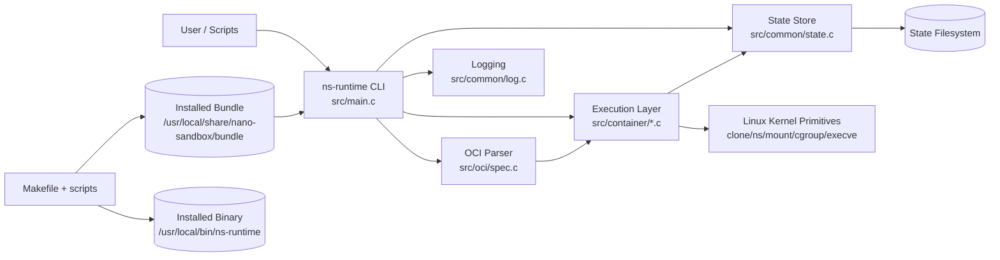

# Architecture Overview

## System Intent

`nano-sandbox` is an educational OCI runtime focused on showing how a container runtime is assembled from Linux building blocks. It supports OCI bundle parsing, lifecycle commands, namespace-based isolation, cgroups integration, and structured runtime state.

For stack placement from Dockerfile/image/containerd to OCI runtime, see [`container-ecosystem-lifecycle.md`](container-ecosystem-lifecycle.md).

## High-Level Topology



## Core Components

### CLI + Orchestration
- File: `src/main.c`
- Responsibilities:
  - Parse commands and options
  - Validate command semantics (`start` defaults detached, `run` defaults attached)
  - Orchestrate lifecycle operations
  - Emit user-facing workflow logs

### OCI Parsing Layer
- Files: `include/nk_oci.h`, `src/oci/spec.c`
- Responsibilities:
  - Parse `config.json` from OCI bundle
  - Validate required sections (`process`, `root`, linux settings)
  - Provide typed in-memory spec model for runtime execution

### Runtime Execution Layer
- Files: `src/container/process.c`, `src/container/namespaces.c`, `src/container/mounts.c`, `src/container/cgroups.c`
- Responsibilities:
  - Build clone flags from requested namespaces
  - `clone()` child process into isolated context
  - Setup rootfs and mount isolation
  - Configure hostname and cgroup membership
  - Execute OCI process (`execve`)

### State Management
- Files: `include/common/state.h`, `src/common/state.c`
- Responsibilities:
  - Persist container metadata and lifecycle state
  - Load/delete state files
  - Manage state root location (`/run/nano-sandbox` for root by default; user path for non-root)

### Logging Subsystem
- Files: `include/nk_log.h`, `src/common/log.c`
- Responsibilities:
  - Structured log levels and timestamps
  - File/line context in messages
  - Parent/child role tagging for process-origin visibility

### Build/Test Tooling
- Files: `Makefile`, `scripts/*.sh`
- Responsibilities:
  - Build profiles, install layout, dependency checks
  - Rootfs preflight validation before install
  - Smoke/integration/perf suites
  - Remote test execution on VM/ECS

## Runtime Data Paths

```mermaid
flowchart TD
    subgraph Install
      A[make install] --> B[/usr/local/bin/ns-runtime]
      A --> C[/usr/local/share/nano-sandbox/bundle]
    end

    subgraph Runtime
      D[ns-runtime create/start/run] --> E[/run/nano-sandbox/[container-id]/state.json]
      D --> F[clone + namespaces + mount + cgroup]
      F --> G[execve OCI process]
    end

    C --> D
```

### Binary + Bundle Install
- Runtime binary: `/usr/local/bin/ns-runtime`
- Installed test bundle: `/usr/local/share/nano-sandbox/bundle`

### State
- Root execution default: `/run/nano-sandbox/<id>/state.json`
- Non-root test default: `~/.local/share/nano-sandbox/run/<id>/state.json`

### Build Artifacts
- `build/bin/ns-runtime`
- `build/obj/...`

## State Model

Container state enum (`include/nk.h`):
- `NK_STATE_INVALID` (error lookup / not found)
- `NK_STATE_CREATED`
- `NK_STATE_RUNNING`
- `NK_STATE_STOPPED`
- `NK_STATE_PAUSED` (reserved for future behavior)

## Design Notes

- The runtime is intentionally explicit over abstract; logs expose each lifecycle stage.
- Child execution readiness uses parent-child synchronization to avoid parent racing ahead before rootfs setup.
- Test and install pipelines now validate rootfs execution viability (not only file existence).
- `exec` is modeled as a session-plane operation over a running container, not a lifecycle transition.

## Exec Architecture Pointer

For `exec`-specific architecture, see [`exec-design.md`](exec-design.md), including:
- mode selection contract (interactive vs `--exec`)
- lifecycle invariants (when state can or cannot change)
- host prerequisite and failure boundary model (`/proc`, `nsenter`, privilege)
