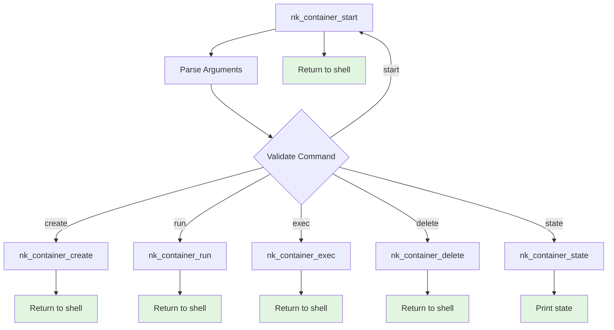
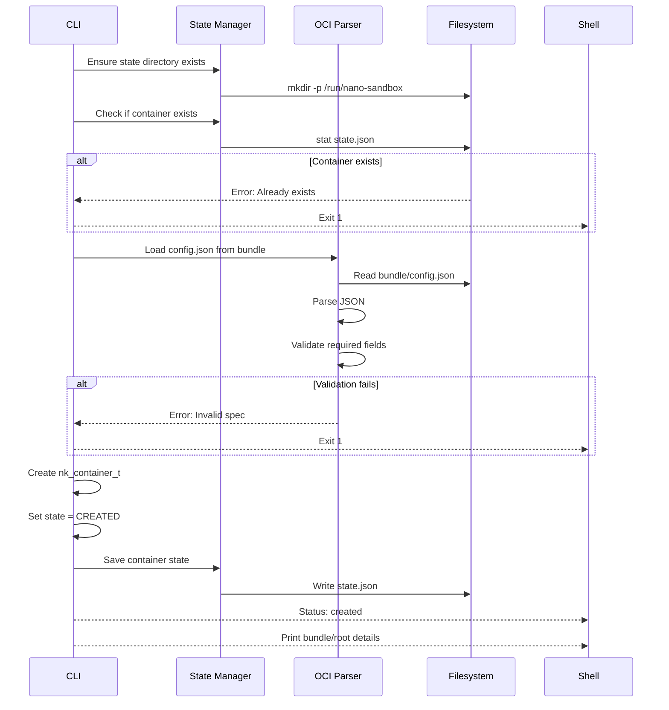
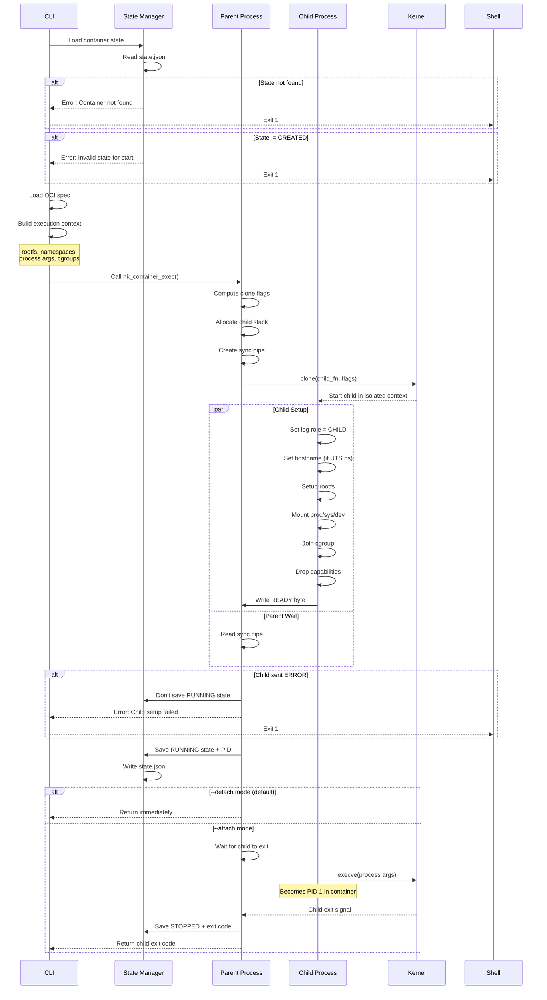
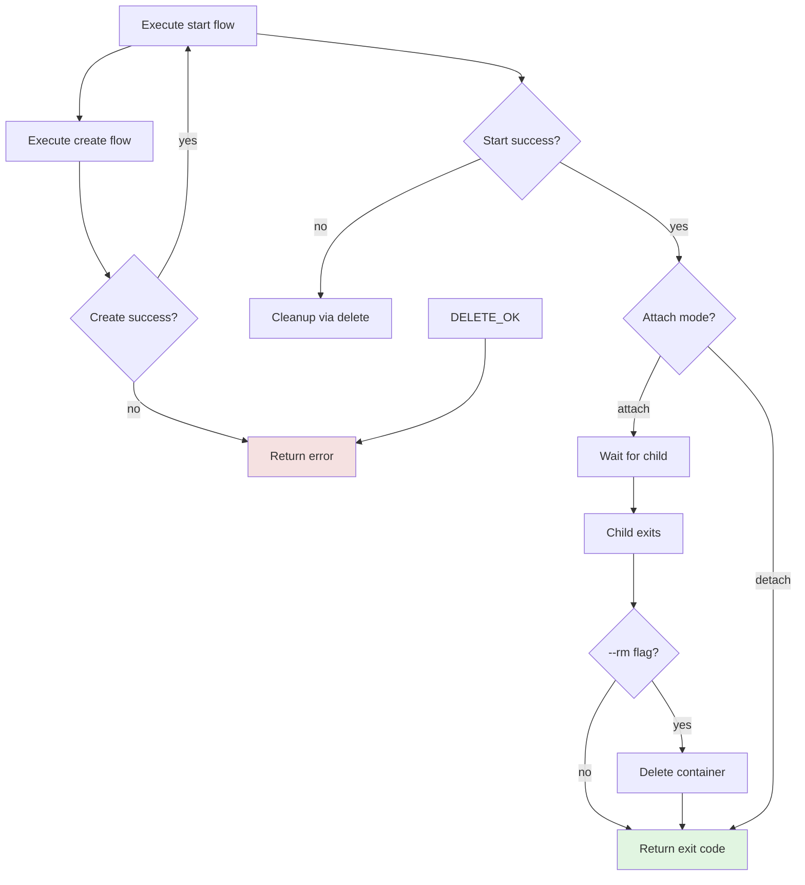
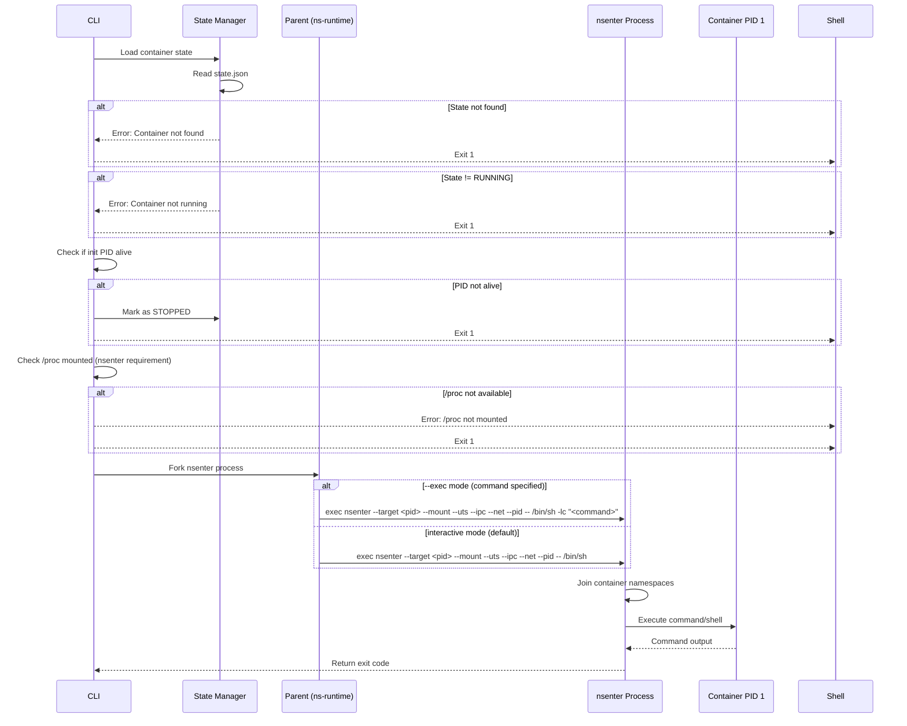
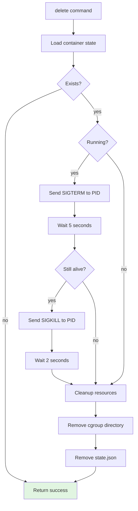
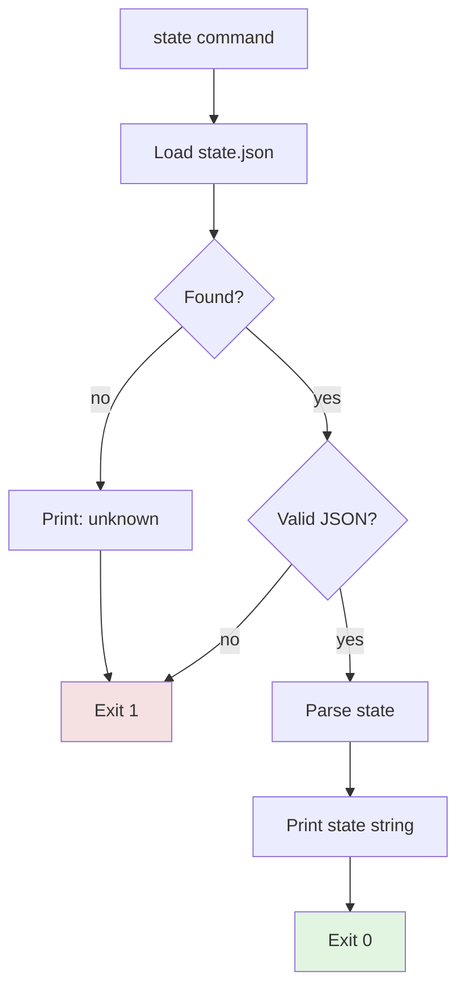
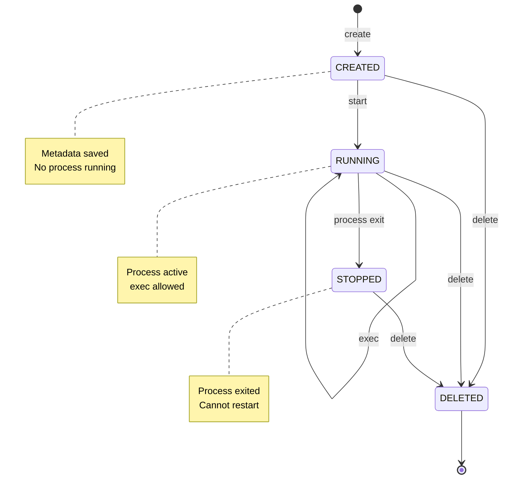

# Command Execution Reference

## Overview

nano-sandbox implements the standard OCI runtime lifecycle commands. This document provides detailed execution flows for each command, including error handling, state transitions, and inter-process communication.

## Command Summary

| Command | Purpose | State Change | Process Created |
|---------|---------|--------------|-----------------|
| `create` | Parse bundle, validate, persist metadata | → CREATED | No |
| `start` | Start container process | CREATED → RUNNING | Yes |
| `run` | Create + start in one step | → CREATED → RUNNING | Yes |
| `exec` | Execute command in running container | None | Yes (temporary) |
| `delete` | Stop and cleanup | → DELETED | No |
| `state` | Query container status | None | No |

## Command Dispatch



## 1. CREATE Command

### Syntax
```bash
nk-runtime create --bundle=<path> <container-id>
```

### Purpose
Parse and validate OCI bundle, create container metadata, persist to disk. Does **NOT** start any process.

### Execution Flow



### State Transition
```
INVALID → CREATED
```

### Key Functions
- `ensure_state_dir()` - Create state root directory
- `nk_state_exists()` - Check for duplicate container ID
- `nk_oci_spec_load()` - Parse config.json
- `nk_oci_spec_validate()` - Validate required sections
- `nk_state_save()` - Persist container metadata

### Output Example
```
[08:39:59.725] [INFO] Creating container 'test1' (mode: container)
[08:39:59.732] [INFO] [1] Loading OCI spec from bundle
[08:39:59.740] [INFO] [2] Validating OCI spec
[08:39:59.745] [INFO] [3] Creating container metadata
[08:39:59.750] [INFO] [4] Saving container state to disk
  Bundle: /path/to/bundle
  Root: rootfs
  Status: created
```

### Error Cases
- Container ID already exists
- Bundle directory not found
- config.json not found or invalid
- Missing required OCI spec fields
- State directory not writable

---

## 2. START Command

### Syntax
```bash
nk-runtime start [--attach|--detach] <container-id>
```

### Purpose
Load created container, spawn isolated process, transition to RUNNING state.

### Execution Flow



### State Transition
```
CREATED → RUNNING → STOPPED (on exit)
```

### Key Functions
- `nk_container_exec()` - Main process orchestration
- `container_child_fn()` - Child process setup
- `setup_namespaces()` - Configure hostname
- `setup_rootfs()` - pivot_root and mounts
- `join_cgroup()` - Add to cgroup
- `drop_capabilities()` - Reduce privileges

### Output Example
```
[08:40:01.123] [INFO] Starting container 'test1'
[08:40:01.125] [INFO] [1] Loading container state
[08:40:01.128] [INFO] [2] Loading OCI spec
[08:40:01.130] [INFO] [3] Setting up namespaces
[08:40:01.132] [DEBUG] Clone flags: 0x3e0f00 (pid,net,ipc,uts,mount)
[08:40:01.135] [INFO] [4] Spawning container process
[08:40:01.140] [INFO] Container started with PID 12345
```

### Error Cases
- Container not found
- Container already running
- Child process creation failed
- Rootfs setup failed
- execve() failed

---

## 3. RUN Command

### Syntax
```bash
nk-runtime run [--attach|--detach] [--rm] --bundle=<path> <container-id>
```

### Purpose
Create + start in one command. Combines both operations with `--rm` option for automatic cleanup.

### Execution Flow



### Key Differences from create+start

| Feature | `run` | `create + start` |
|---------|-------|------------------|
| Container state | Must not exist | Must be CREATED |
| Attach mode | Default (user sees output) | Default detached |
| `--rm` option | Yes | No (must delete manually) |
| Exit code | Container exit code | Runtime operation status |

### Use Cases

**Attached run (default):**
```bash
nk-runtime run --bundle=/path/to/bundle mycontainer
# Creates, starts, waits for exit, returns container exit code
```

**Detached run:**
```bash
nk-runtime run --detach --bundle=/path/to/bundle mycontainer
# Creates, starts, returns immediately
```

**Auto-cleanup:**
```bash
nk-runtime run --rm --bundle=/path/to/bundle temp
# Creates, starts, waits, deletes on exit
```

---

## 4. EXEC Command

### Syntax
```bash
nk-runtime exec [--exec "<command>"] <container-id>
```

### Purpose
Enter namespaces of a **running** container and execute a command. Interactive by default.

### Execution Flow



### How nsenter Works

`nsenter` allows entering the namespaces of another process:

```bash
nsenter --target <pid> --mount --uts --ipc --net --pid -- /bin/sh
```

**What happens:**
1. `--target <pid>` - Target container init process
2. `--mount` - Enter mount namespace (see container rootfs)
3. `--uts` - Enter UTS namespace (see container hostname)
4. `--ipc` - Enter IPC namespace (see container IPC)
5. `--net` - Enter network namespace (see container network)
6. `--pid` - Enter PID namespace (see container processes)
7. `-- /bin/sh` - Execute shell in container context

**Why /proc is required:**
- `nsenter` reads `/proc/<pid>/ns/*` to get namespace file descriptors
- Without `/proc` mounted, `nsenter` cannot work

### Interactive vs Command Mode

**Interactive (default):**
```bash
nk-runtime exec mycontainer
# Drops you into /bin/sh inside container
# Type commands interactively
# Type 'exit' to leave
```

**Command mode:**
```bash
nk-runtime exec --exec "ps -ef" mycontainer
# Executes 'ps -ef' in container
# Returns immediately with output
```

### Error Cases
- Container not found
- Container not running
- Container PID died (marked STOPPED)
- /proc not mounted
- nsenter not found
- Permission denied

---

## 5. DELETE Command

### Syntax
```bash
nk-runtime delete <container-id>
```

### Purpose
Stop running container (if needed) and cleanup all state and resources.

### Execution Flow



### Graceful vs Forced Termination

**Graceful termination (SIGTERM):**
- Allows process to cleanup
- Handle signals, close connections
- Wait 5 seconds for exit

**Forced termination (SIGKILL):**
- Immediate kernel termination
- No cleanup possible
- Used if SIGTERM fails

### Cleanup Steps

1. **Stop process** (if running)
   - Send SIGTERM
   - Wait up to 5 seconds
   - Send SIGKILL if needed

2. **Remove cgroup**
   ```bash
   rmdir /sys/fs/cgroup/nano-sandbox/<container-id>
   ```

3. **Remove state**
   ```bash
   rm /run/nano-sandbox/<container-id>/state.json
   rmdir /run/nano-sandbox/<container-id>
   ```

### Output Example
```
[08:42:15.123] [INFO] Deleting container 'test1'
[08:42:15.125] [INFO] Container running, sending SIGTERM
[08:42:15.130] [INFO] Container stopped
[08:42:15.131] [INFO] Removing cgroup
[08:42:15.132] [INFO] Removing state file
  Status: deleted
```

---

## 6. STATE Command

### Syntax
```bash
nk-runtime state <container-id>
```

### Purpose
Query and display container lifecycle state.

### Execution Flow



### Output Examples

**Created container:**
```bash
$ nk-runtime state mycontainer
created
```

**Running container:**
```bash
$ nk-runtime state mycontainer
running
```

**Stopped container:**
```bash
$ nk-runtime state mycontainer
stopped
```

**Unknown container:**
```bash
$ nk-runtime state nonexistent
unknown
$ echo $?
1
```

### State Strings

| State | Meaning | Can Start? | Can Delete? |
|-------|---------|------------|-------------|
| `created` | Metadata saved, not running | ✅ Yes | ✅ Yes |
| `running` | Process active | ❌ No | ✅ Yes |
| `stopped` | Process exited | ❌ No | ✅ Yes |
| `unknown` | Not found | ❌ No | ❌ N/A |

---

## Lifecycle State Machine

Complete state transition diagram:



## Error Handling Model

Errors are surfaced in three layers:

### 1. Return Codes
- `0` - Success
- `1` - Error (check logs for details)

### 2. Structured Logs
```
[timestamp] [LEVEL] [ROLE] message: details
                       ^^^^
                PARENT/CHILD/HOST
```

### 3. User-Facing Messages
```
Error: Failed to open state file: Permission denied
```

## Best Practices

### PID 1 Considerations

**Avoid shell as PID 1 for production:**
```json
"process": {
  "args": ["/bin/sh"]  // Bad: typing 'exit' stops container
}
```

**Use long-running process:**
```json
"process": {
  "args": ["/bin/busybox", "sh", "-c", "while :; do sleep 3600; done"]  // Good
}
```

**Then use exec for interaction:**
```bash
nk-runtime start mycontainer    # Starts in background
nk-runtime exec mycontainer     # Interactive shell
exit                            # Shell exits, container keeps running
nk-runtime delete mycontainer   # Cleanup when done
```

### State Management

**Always check state before operations:**
```bash
# Check if created before starting
nk-runtime state mycontainer | grep -q created && nk-runtime start mycontainer

# Check if running before exec
nk-runtime state mycontainer | grep -q running && nk-runtime exec mycontainer
```

**Cleanup after use:**
```bash
# Quick test with auto-cleanup
nk-runtime run --rm --bundle=/path/to/bundle test
```

## See Also

- [Architecture Overview](architecture-overview.md)
- [Kernel Mechanisms](kernel-mechanisms.md)
- [Container Ecosystem](container-ecosystem-lifecycle.md)
