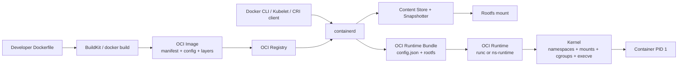
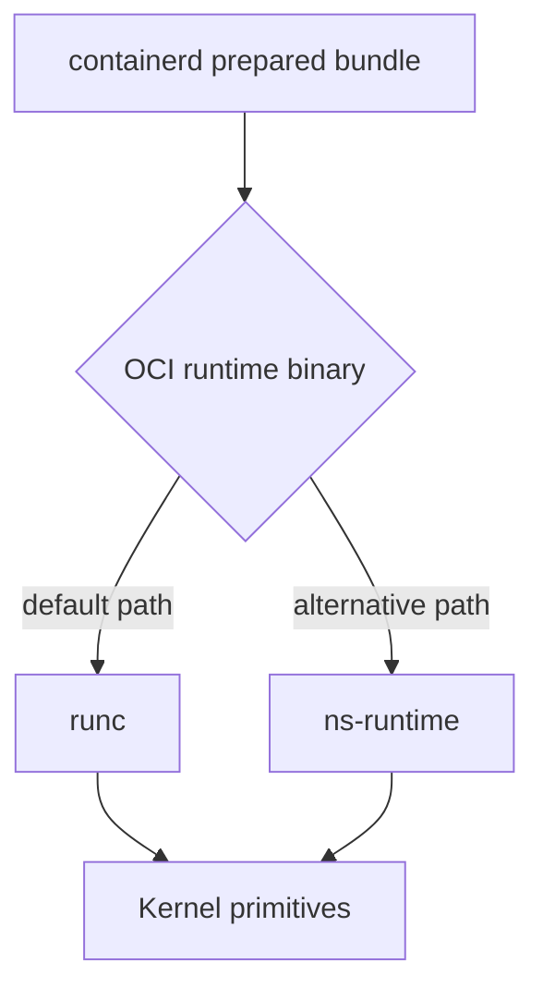

# Container Ecosystem Lifecycle

## Why This Document

This document explains the full container ecosystem path from:

`Dockerfile` -> OCI image -> node-side rootfs + runtime config -> OCI runtime (`runc` or `ns-runtime`)

The goal is to make clear where `nano-sandbox` fits in the stack and what components are intentionally out of scope for this repository.

## Layer Model

Container execution is usually split into four layers:

1. Authoring/Build layer: Dockerfile/BuildKit produce OCI images.
2. Distribution layer: registry stores/publishes image artifacts.
3. Node preparation layer: containerd pulls image, unpacks layers, prepares rootfs and `config.json`.
4. Runtime execution layer: OCI runtime starts PID 1 with kernel isolation primitives.

`nano-sandbox` is primarily layer 4.

## End-to-End Flow

## Artifact Contracts

### 1) OCI Image (build/distribution contract)

- Spec family: OCI Image Spec
- Main objects:
  - Image manifest (references config + layer digests)
  - Image config JSON (entrypoint/cmd/env/user/workdir/metadata)
  - Layer blobs (filesystem diffs)
- Owned by: builders and registries

### 2) OCI Runtime Bundle (node/runtime contract)

- Spec family: OCI Runtime Spec
- Main objects:
  - `config.json` (process, mounts, namespaces, linux options)
  - `rootfs/` directory (mounted filesystem tree for the container)
- Owned by: node runtime stack (`containerd` + shim/plugins)

### 3) Runtime State (execution contract)

- Main objects:
  - runtime-specific state files (container id, pid, lifecycle status)
- Owned by: OCI runtime implementation (`runc`, `ns-runtime`, etc.)

## What containerd Usually Does Before OCI Runtime

Before calling an OCI runtime, containerd typically:

1. Resolves and pulls image artifacts from registry.
2. Verifies and stores content by digest.
3. Unpacks layers into snapshotter-managed filesystem.
4. Mounts snapshot as a rootfs view.
5. Materializes OCI runtime `config.json` (entrypoint/cmd/env/cwd/user, namespaces, mounts, cgroups).
6. Uses shim/runtime integration to call OCI runtime lifecycle operations.

At runtime invocation time, OCI runtime generally receives a bundle-equivalent view: `config.json` + `rootfs`.

## Where This Repository Stands

`nano-sandbox` currently implements the OCI runtime execution layer directly.

### Implemented in this repo

- OCI runtime-side spec parsing from bundle `config.json`
- Container lifecycle commands (`create`, `start`, `run`, `exec`, `delete`, `state`)
- Namespace/mount/cgroup/process execution path
- Runtime state persistence and logging

### Not implemented in this repo (usually containerd/build stack)

- Dockerfile build pipeline
- Image pull/push, registry auth, content-addressed storage
- Layer unpack and snapshotter drivers
- Full CRI/runtime-shim integration

In short: this repo is not an image builder or registry client. It is the runtime endpoint that executes a prepared OCI runtime bundle.

## runc vs nano-sandbox in This Lifecycle

Both occupy the same architectural slot: OCI runtime execution backend.

Differences are implementation and feature maturity, not conceptual placement in the lifecycle.

## How to Think About the Interfaces

A useful mental boundary is:

- Upstream boundary of `ns-runtime`: valid OCI runtime bundle (`config.json` + `rootfs`)
- Downstream boundary of `ns-runtime`: Linux kernel APIs (`clone`, mounts, cgroups, `execve`)

Everything above upstream boundary (Dockerfile, registry, image pull/unpack) is outside this repo.

## Kubernetes/CRI Path (Conceptual)

When Kubernetes is involved:

1. Kubelet sends CRI calls (`RunPodSandbox`, `CreateContainer`, `StartContainer`) to container runtime endpoint.
2. Runtime backend (commonly containerd) resolves images and prepares bundle/rootfs.
3. Runtime backend invokes OCI runtime binary.
4. OCI runtime launches isolated process.

This repo corresponds to step 3-4.

## Practical Implication for Users of This Repo

Current workflow in this repository is bundle-first:

1. Prepare/install bundle (`config.json` + `rootfs`).
2. Run `ns-runtime` lifecycle commands.

To support image-first UX like `docker run <image>`, a higher layer must be added (or integrated) to translate image references into runtime bundles before invoking `ns-runtime`.

## Future Integration Directions

To place `ns-runtime` behind a more Docker-like control plane, the missing integration layers are:

1. Image resolver/puller + local content store.
2. Layer unpack + snapshot management.
3. Bundle generator from image config + runtime policy.
4. Shim/adapter API to orchestrate OCI lifecycle calls.

These are additive around the runtime core and do not require changing the core container execution model already implemented here.
