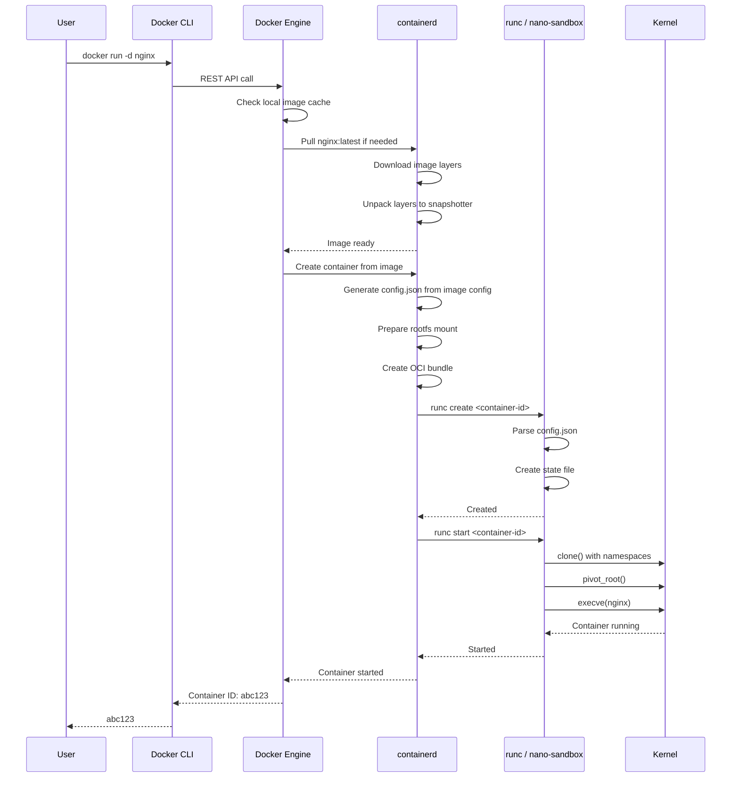
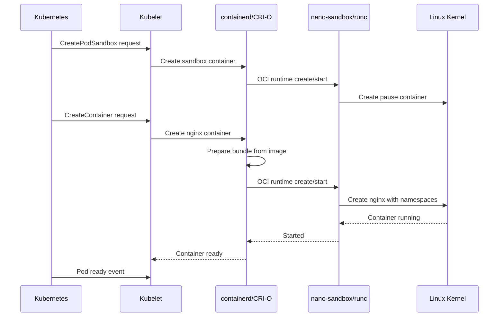

# Container Ecosystem: Where nano-sandbox Fits

## Executive Summary

**nano-sandbox** is an **OCI runtime** - the component that actually executes containers. It sits at the bottom of the container stack, between the container orchestrator (Docker, containerd, Kubernetes) and the Linux kernel.

## The Container Technology Stack

```
┌─────────────────────────────────────────────────────────────────┐
│                        User Experience                          │
│  Docker CLI, kubectl, Nomad,或其他 orchestration tools         │
└─────────────────────────────────────────────────────────────────┘
                              ↓
┌─────────────────────────────────────────────────────────────────┐
│                    Container Orchestrator                       │
│  Docker Engine, containerd, CRI-O, Podman, cri-containerd     │
└─────────────────────────────────────────────────────────────────┘
                              ↓
┌─────────────────────────────────────────────────────────────────┐
│                       OCI Runtime Layer                         │
│  ┌──────────┐  ┌──────────┐  ┌──────────────────┐              │
│  │  runc    │  │ crun     │  │ nano-sandbox     │              │
│  │ (golang) │  │ (C)      │  │ (C, educational) │              │
│  └──────────┘  └──────────┘  └──────────────────┘              │
└─────────────────────────────────────────────────────────────────┘
                              ↓
┌─────────────────────────────────────────────────────────────────┐
│                      Linux Kernel                               │
│  namespaces | cgroups | mount | seccomp | AppArmor | SELinux   │
└─────────────────────────────────────────────────────────────────┘
```

## Detailed Breakdown

### Layer 1: User Interface

**Examples:**
- `docker run nginx`
- `kubectl run nginx --image=nginx`
- `nerdctl run nginx`

**Responsibilities:**
- Parse user commands
- Build/pull images
- Manage container lifecycle
- Provide user-friendly output

**Projects:**
- Docker Engine
- Podman
- Kubernetes (via kubelet)

### Layer 2: Image Management

**What it does:**
- Pull images from registries (Docker Hub, ECR, GCR)
- Store images locally
- Manage image layers
- Build images from Dockerfiles

**Projects:**
- Docker Engine
- BuildKit
- Podman
- Skopeo

### Layer 3: Container Runtime (High-Level)

**What it does:**
- Manage container lifecycle
- Prepare runtime bundles from images
- Handle networking, storage, security policies
- Provide CRI API for Kubernetes

**Projects:**
- **containerd** - Industry standard, used by Docker/Kubernetes
- **CRI-O** - Lightweight CRI implementation
- **Podman** - Daemonless alternative to Docker

### Layer 4: OCI Runtime (Where nano-sandbox lives)

**What it does:**
- Parse OCI runtime spec (`config.json`)
- Set up namespaces, cgroups, mounts
- Execute container process
- Manage container state

**Projects:**
- **runc** - Most widely used (written in Go)
- **crun** - Alternative C implementation
- **nano-sandbox** - Educational C implementation

### Layer 5: Linux Kernel

**What it provides:**
- Namespaces (isolation)
- Cgroups (resource limits)
- Mounts (filesystem)
- Seccomp (syscall filtering)
- LSMs (security policies)

## End-to-End Flow: From Docker Command to Container Process

### Using Docker



### Using Kubernetes



## What nano-sandbox Does (and Doesn't Do)

### ✅ nano-sandbox DOES:

**OCI Runtime Responsibilities:**
- ✅ Parse `config.json` from OCI bundle
- ✅ Validate OCI runtime spec
- ✅ Create container metadata
- ✅ Execute `create/start/run/exec/delete/state` commands
- ✅ Set up namespaces (pid, net, ipc, uts, mount)
- ✅ Configure cgroups (memory, cpu, pids)
- ✅ Execute container process with `clone()` + `execve()`
- ✅ Manage container state persistence
- ✅ Handle signals (SIGTERM, SIGKILL)
- ✅ Cleanup resources on delete

### ❌ nano-sandbox does NOT do:

**Higher-Level Responsibilities (done by Docker/containerd):**
- ❌ Build images from Dockerfile
- ❌ Pull/push images from registries
- ❌ Manage image storage
- ❌ Unpack image layers
- ❌ Generate config.json from image config
- ❌ Provide CRI API for Kubernetes
- ❌ Manage container networking
- ❌ Manage volume plugins

**Production Features (done by runc/crun):**
- ❌ Comprehensive seccomp filter support
- ❌ AppArmor/SELinux integration
- ❌ Device cgroup management
- ❌ User namespace mapping
- ❌ Container hooks
- ❌ Extensive testing/validation

## Artifact Flow: Image to Container

### OCI Image (Distribution Format)

```
nginx:latest
├── Manifest
│   ├── config digest (sha256:...)
│   └── layer digests
│       ├── sha256:abc... (layer 1)
│       ├── sha256:def... (layer 2)
│       └── sha256:ghi... (layer 3)
├── Image Config
│   ├── Entrypoint: ["/docker-entrypoint.sh"]
│   ├── Cmd: ["nginx", "-g", "daemon off;"]
│   ├── Env: ["PATH=/usr/local/sbin:..."]
│   └── WorkingDir: /usr/share/nginx/html
└── Layer Blobs
    ├── ubuntu base (rootfs)
    ├── nginx binaries
    └── config files
```

### OCI Runtime Bundle (Execution Format)

```
/var/lib/containerd/io.containerd.runtime.v2.task/k8s.io/<id>/
├── config.json
│   {
│     "ociVersion": "1.0.2-dev",
│     "process": {
│       "args": ["nginx", "-g", "daemon off;"],
│       "cwd": "/usr/share/nginx/html",
│       "env": ["PATH=...", ...],
│       "user": "nginx"
│     },
│     "root": {
│       "path": "rootfs",
│       "readonly": true
│     },
│     "mounts": [
│       {"destination": "proc", "type": "proc"},
│       {"destination": "dev", "type": "tmpfs", ...},
│       ...
│     ],
│     "linux": {
│       "namespaces": [
│         {"type": "pid"},
│         {"type": "network"},
│         {"type": "ipc"},
│         {"type": "uts"},
│         {"type": "mount"}
│       ]
│     }
│   }
└── rootfs/
    ├── bin/
    ├── etc/
    ├── usr/
    └── ... (unpacked layers)
```

### nano-sandbox Execution

```
nano-sandbox reads:
  ├── config.json → Parse OCI spec
  └── rootfs/    → pivot_root() into this

nano-sandbox creates:
  ├── /run/nano-sandbox/<id>/state.json (metadata)
  └── container process (with namespaces, cgroups, etc.)
```

## Comparison to Production Runtimes

### runc (Industry Standard)

**Written:** Go
**Lines of Code:** ~15,000
**Maintained by:** Open Containers Initiative
**Used by:** Docker, containerd, Kubernetes (via containerd)

**Key Features:**
- Full OCI spec compliance
- Extensive testing
- Production hardened
- Seccomp, AppArmor, SELinux support
- User namespaces
- Comprehensive error handling

**Trade-offs:**
- More complex codebase
- Harder to learn from
- Go runtime overhead
- Less explicit execution

### crun (Alternative)

**Written:** C
**Lines of Code:** ~18,000
**Maintained by:** RedHat / OCI
**Used by:** Podman, containerd (optional)

**Key Features:**
- Native C performance
- No Go runtime overhead
- Full OCI compliance
- Better seccomp support than runc

**Trade-offs:**
- More dependencies (libocispec)
- Still complex for learning

### nano-sandbox (Educational)

**Written:** C
**Lines of Code:** ~4,300
**Maintained by:** Educational project
**Used by:** Learning environments

**Key Features:**
- Minimal dependencies (jansson only)
- Educational logging mode
- Explicit parent/child synchronization
- Clear code structure
- Comprehensive documentation

**Trade-offs:**
- Not production ready
- Missing advanced features
- Simplified error handling
- Limited validation

## Architecture Comparison

### runc Architecture

```go
// Simplified runc flow
func create(containerId, bundle) {
    spec := readSpec(bundle)
    validate(spec)
    createState(containerId, spec)
}

func start(containerId) {
    spec := loadState(containerId)
    child := createContainer(spec)
    waitReady(child)
    saveState(containerId, RUNNING, child.Pid)
}
```

### nano-sandbox Architecture

```c
// nano-sandbox flow with explicit logging
int nk_container_create(const nk_options_t *opts) {
    nk_log_info("Creating container '%s'", opts->container_id);
    nk_log_step(1, "Loading OCI spec from bundle");
    nk_oci_spec_t *spec = nk_oci_spec_load(opts->bundle_path);

    nk_log_step(2, "Validating OCI spec");
    nk_oci_spec_validate(spec);

    nk_log_step(3, "Creating container metadata");
    nk_container_t *container = calloc(1, sizeof(*container));
    // ... detailed steps with logging
}
```

**Key Difference:**
- runc: Optimized for production (minimal logging)
- nano-sandbox: Optimized for learning (explicit steps)

## How to Integrate nano-sandbox

### Method 1: Replace runc in containerd

**Edit `/etc/containerd/config.toml`:**
```toml
[plugins."io.containerd.grpc.v1.cri".containerd]
  default_runtime_name = "nano-sandbox"

  [plugins."io.containerd.grpc.v1.cri".containerd.runtimes.nano-sandbox]
    runtime_type = "io.containerd.runc.v1"
    runtime_root = "/run/nano-sandbox"
    runtime_engine = "/usr/local/bin/nk-runtime"
```

### Method 2: Use with Podman

```bash
# Set runtime in podman
export PODMAN_RUNTIME=/usr/local/bin/nk-runtime
podman run -d nginx
```

### Method 3: Use directly (educational)

```bash
# Prepare bundle manually
mkdir -p mycontainer/rootfs
docker export $(docker create nginx) | tar -C mycontainer/rootfs -xf
# ... generate config.json ...

# Run with nano-sandbox
nk-runtime create --bundle=mycontainer nginx
nk-runtime start nginx
```

## When to Use Each Runtime

| Scenario | Recommended Runtime | Reason |
|----------|-------------------|--------|
| Production workloads | runc | Most tested, industry standard |
| Resource-constrained | crun | C performance, minimal memory |
| Learning/Teaching | nano-sandbox | Explicit, documented, observable |
| Custom needs | Fork runc/crun | Production base with customization |
| VM isolation | Kata Containers | Firecracker-based VM runtime |

## Future Integration Paths

### Short-term: Educational Tool

```bash
# Teaching containers
./nk-runtime -E create --bundle=/path/to/bundle test
./nk-runtime -E start test
# See detailed explanations of each step
```

### Mid-term: Development/Test Runtime

```bash
# CI/CD pipelines
export OCI_RUNTIME=/usr/local/bin/nk-runtime
docker build -t myapp .
docker run myapp
# Uses nano-sandbox with educational logging for debugging
```

### Long-term: Production Fork

**To make nano-sandbox production-ready:**
1. Add comprehensive error handling
2. Implement full seccomp support
3. Add AppArmor/SELinux integration
4. Implement user namespace mapping
5. Add container hooks
6. Extensive security audit
7. Performance benchmarking and optimization
8. CVE detection and remediation

## Summary

**nano-sandbox Position:**
- **Layer:** OCI Runtime (bottom of stack)
- **Purpose:** Educational implementation of OCI spec
- **Target:** Students, developers learning containers
- **Competition:** runc (production), crun (alternative)

**Key Insight:**
nano-sandbox doesn't compete with Docker or containerd - it complements them by providing a transparent, learning-friendly OCI runtime that can be swapped in for educational purposes or customized development.

**Value Proposition:**
- Understand how containers work by reading the code
- Learn OCI runtime spec by implementing it
- Experiment with runtime features in simple C
- Build custom runtimes for specific needs
- Debug container issues with explicit logging
