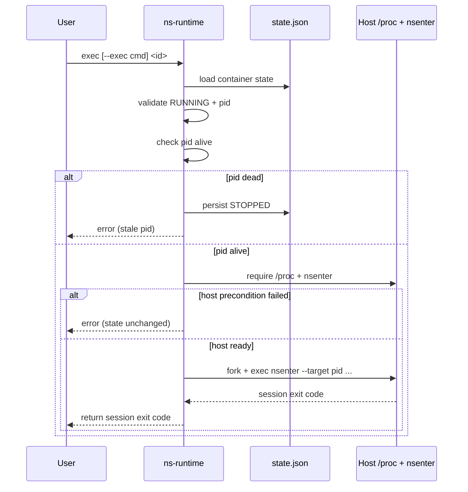

# Exec Design

## Purpose

`exec` is a session-plane operation, not a lifecycle-plane operation.

- Lifecycle plane: `create`, `start`, `run`, `delete`, `state` manage container identity and PID 1 lifecycle.
- Session plane: `exec` opens an additional process session inside namespaces of an already running container.

This split is intentional. It mimics common container runtime behavior where container liveness is defined by PID 1, while user sessions are transient and repeatable.

## Design Goals

1. Deterministic behavior with no heuristics.
2. Preserve running container state when `exec` tooling fails.
3. Mark container `stopped` only when init PID is genuinely dead.
4. Keep implementation simple and inspectable for educational use.

## Command Contract

`exec` has two deterministic modes:

- Interactive mode: `ns-runtime exec <id>`
- Command mode: `ns-runtime exec --exec "<cmd>" <id>`

Mode selection is a direct function of whether `--exec` is provided. There is no runtime scoring, probing, or fallback logic.

## Control Model

`exec` enters namespaces of the container's init PID via `nsenter`:

- Namespace target source: persisted state (`state.json` -> `pid`)
- Namespace set: `--mount --uts --ipc --net --pid`
- In-container command:
  - interactive: `/bin/sh`
  - command mode: `/bin/sh -lc "<cmd>"`

Rationale:
- `nsenter` keeps implementation small and explicit.
- Using a shell in command mode provides familiar command chaining semantics.

## State Invariants

The following invariants define correctness:

1. Precondition: container must be `RUNNING` with `pid > 0`.
2. If init PID is dead, state must transition to `STOPPED`.
3. If `exec` cannot run due to host/tooling conditions (for example missing `/proc` or missing `nsenter`), container state must remain `RUNNING`.
4. Exit of an `exec` shell must not mutate container state.
5. Container lifecycle remains bound to PID 1 only.

These invariants are validated in integration tests (`scripts/suites/integration/test_lifecycle.sh`).

## Host Preconditions

`exec` requires host prerequisites because it is host-side namespace entry:

1. `/proc` must be mounted and readable (`/proc/self/ns/pid`).
2. `nsenter` must be available in host PATH.
3. Caller must have privileges to enter target namespaces (typically root).

When `/proc` is unavailable, `exec` fails with an explicit error and does not flip container state to `stopped`.

## Failure Taxonomy

### Logical state failure
- Condition: container is not `RUNNING` or PID missing.
- Effect: `exec` fails; state unchanged.

### Stale PID failure
- Condition: state says running, but init PID is dead.
- Effect: runtime updates state to `STOPPED`, then fails `exec`.

### Host precondition failure
- Condition: `/proc` missing, `nsenter` missing, or permission denied.
- Effect: `exec` fails; container state remains `RUNNING` if PID is alive.

### In-session process failure
- Condition: command inside namespace exits non-zero.
- Effect: `exec` returns command exit code; container state unchanged.

## Sequence

## Why Default Interactive Shell Exists

Interactive default exists for ergonomics and parity with common runtime UX:

- `exec <id>` gives direct shell access for inspection/debug.
- `exec --exec "<cmd>" <id>` is explicit for automation.

The default is a CLI policy, not a container policy. Container liveness is still governed by PID 1 only.

## Relationship to PID 1

- If PID 1 exits, container is stopped.
- If an `exec` shell exits, only that `exec` session ends.

This is why production setups should keep PID 1 as a long-running service (or init wrapper) and use `exec` for transient sessions.

## Security Notes

Current model assumes trusted operator control:

- No per-container exec ACL layer yet.
- `exec` inherits host-side privilege model and namespace entry permissions.
- Runtime does not currently implement Docker-style user remapping for exec sessions.

For future hardening, an exec authorization and audit layer can be added without changing lifecycle semantics.
