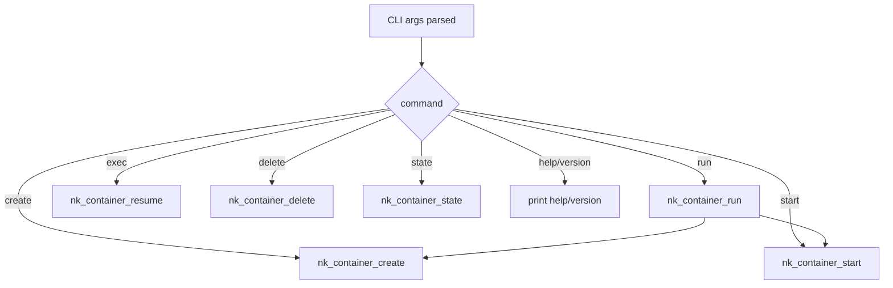
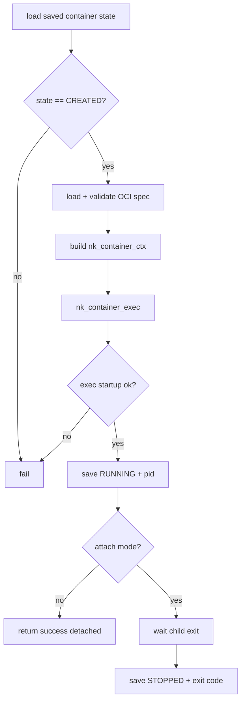
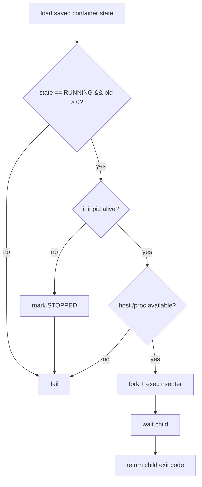
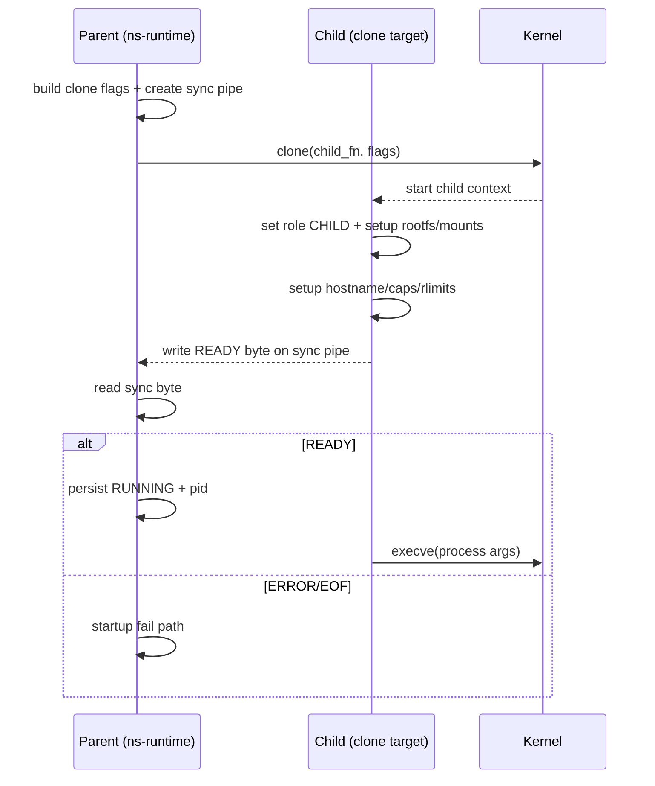
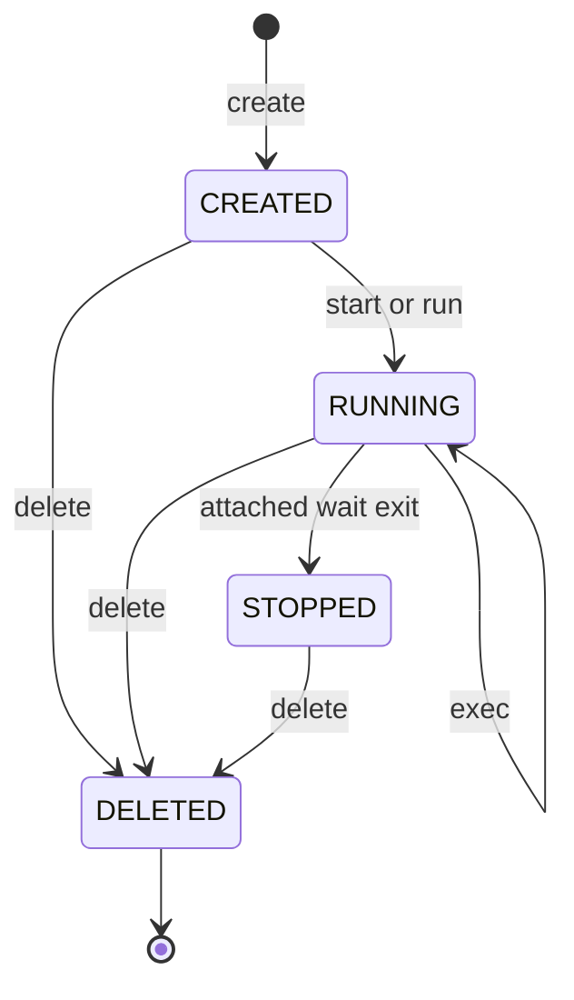

# Execution Flow

## Command Summary

- `create`: parse + validate OCI bundle, persist metadata, no process spawned.
- `start`: load created container, build execution context, clone child, start process.
- `run`: `create` + `start` in one command; attached by default.
- `exec`: enter namespaces of a running container (`nsenter`), interactive by default.
- `delete`: stop running process (if needed), cleanup cgroup/state.
- `state`: query persisted state; non-zero exit for not found.

## Command Dispatch Map

## `create` Flow

1. Parse args and validate command shape.
2. Ensure state root exists.
3. Reject duplicate container id.
4. Load OCI spec from bundle and validate it.
5. Construct in-memory `nk_container_t` in `CREATED` state.
6. Persist state to disk.

Output expectation:
- Logs include bundle/root details and final `Status: created`.

## `start` Flow

1. Load container state by id.
2. Enforce state precondition (`CREATED`).
3. Load OCI spec and log parsed startup summary.
4. Build `nk_container_ctx_t`:
   - rootfs path
   - namespace list
   - process args/env/cwd
   - cgroup config
5. Call `nk_container_exec()`.
6. On success:
   - persist `RUNNING` state with PID
   - detached mode returns immediately
   - attached mode waits for child exit, then persists `STOPPED`

## `run` Flow

1. Execute `create` flow.
2. Execute `start` flow.
3. If `--rm` set and execution completed, delete container metadata.

Return semantics:
- Attached mode returns container process exit code.
- Detached mode returns runtime operation status.

## `exec` Flow

Design reference: for rationale, invariants, and failure boundaries, see [`exec-design.md`](exec-design.md).

1. Load container state.
2. Enforce state precondition (`RUNNING` + live init PID).
3. Require host `/proc` to be mounted (`nsenter` depends on `/proc/<pid>/ns/*`).
4. Spawn `nsenter --target <pid> --mount --uts --ipc --net --pid`.
5. Execute:
   - interactive mode: `/bin/sh`
   - command mode: `/bin/sh -lc "<cmd>"`
6. Return entered-command exit code.
7. If init PID is gone, persist `STOPPED` state.

## Child Process Startup (`nk_container_exec`)

1. Parent computes namespace clone flags.
2. Parent allocates child stack and opens sync pipe.
3. `clone()` starts child function.
4. Child sequence:
   - switch log role to `CHILD`
   - configure hostname (if UTS ns requested)
   - setup rootfs/mounts
   - apply capability/resource steps
   - signal parent readiness over pipe
   - `execve()` configured process
5. Parent waits for readiness byte:
   - ready -> continue + state update
   - error/EOF -> fail startup

## `delete` Flow

1. Load state.
2. If running, send `SIGTERM`, then `SIGKILL` fallback.
3. Cleanup cgroup path.
4. Remove persisted state.
5. Report `Status: deleted`.

## `state` Flow

1. Load state file by id.
2. Print state string (`created`, `running`, `stopped`, `paused`).
3. If missing/invalid, print `unknown` and exit non-zero.

## Failure Visibility Model

Failure classes are surfaced in three layers:
1. Runtime return code (`main` command exit status)
2. Structured logs (parent/child role + file:line)
3. Integration tests that parse outputs for startup failure patterns

## Lifecycle State Transitions

