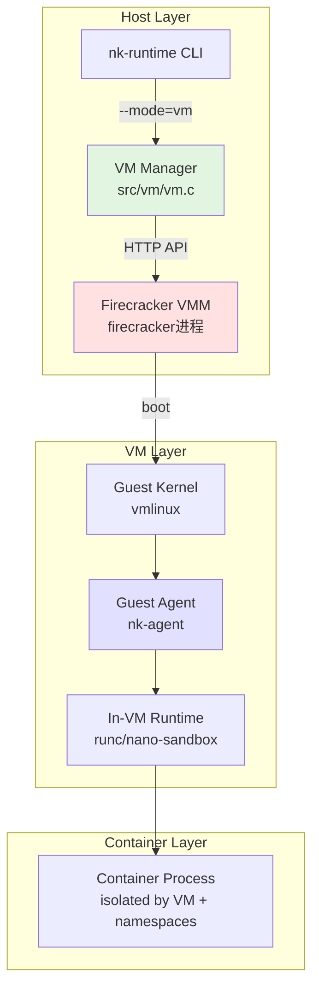
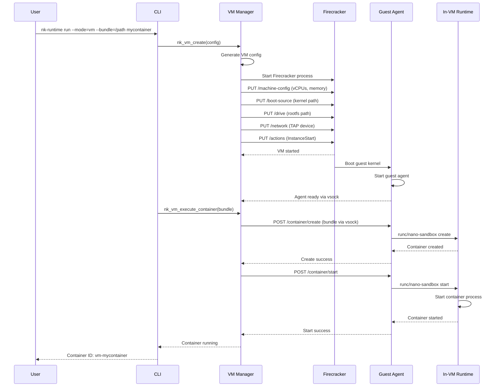

# VM Mode Implementation Plan

## Executive Summary

This document outlines the implementation plan for VM-based container execution in nano-sandbox using Firecracker. The VM mode provides stronger isolation than pure containers by running each container (or pod) in a lightweight virtual machine, similar to Kata Containers but with educational simplicity and explicit observability.

## Goals

1. **Educational Value**: Clearly demonstrate how VM-based container runtimes work
2. **OCI Compatibility**: Maintain compatibility with existing OCI bundles and tooling
3. **Explicit Architecture**: Every step observable via logging and educational mode
4. **Simplified Design**: Focus on core concepts over production feature completeness
5. **Firecracker Integration**: Use lightweight VMM for minimal overhead

## Architecture Overview

### High-Level Design



### Data Flow: Container Creation in VM Mode



## API Design

### 1. VM Lifecycle API

The VM API in `include/nk_vm.h` already provides the core interface:

```c
/* VM configuration */
typedef struct nk_vm_config {
    char *vm_id;                    /* VM identifier */
    uint32_t vcpus;                 /* Number of vCPUs (default: 1) */
    uint64_t memory_mb;             /* Memory in MB (default: 512) */
    char *kernel_path;              /* Path to kernel image */
    char *rootfs_path;              /* Path to rootfs/initramfs */
    bool enable_network;            /* Enable network interface */
    char *tap_device;               /* TAP device name */
} nk_vm_config_t;

/* VM state */
typedef enum {
    NK_VM_NOT_CREATED,
    NK_VM_CREATED,
    NK_VM_RUNNING,
    NK_VM_STOPPED,
    NK_VM_PAUSED
} nk_vm_state_t;

/* VM context */
typedef struct nk_vm {
    char *vm_id;                    /* VM identifier */
    nk_vm_config_t config;          /* VM configuration */
    nk_vm_state_t state;            /* Current state */
    pid_t firecracker_pid;          /* Firecracker VMM PID */
    char *api_socket;               /* Firecracker API socket path */
    int control_fd;                 /* Control channel (vsock) */
} nk_vm_t;
```

### 2. VM Creation API

```c
/**
 * nk_vm_create - Create a new VM
 * @config: VM configuration
 *
 * Creates a Firecracker VM with the specified configuration:
 * 1. Creates API socket directory
 * 2. Spawns firecracker process with --api-sock
 * 3. Configures machine via HTTP API
 * 4. Sets up boot source and drives
 * 5. Configures network (optional)
 *
 * Returns: VM context, or NULL on error
 */
nk_vm_t *nk_vm_create(const nk_vm_config_t *config);
```

**Firecracker API calls during create:**
```bash
# Set machine configuration
PUT http://localhost/api/v1/machine-config
{
  "vcpu_count": 1,
  "mem_size_mib": 512,
  "ht_enabled": false
}

# Set boot source
PUT http://localhost/api/v1/boot-source
{
  "kernel_image_path": "/var/lib/nano-sandbox/vmlinux",
  "boot_args": "console=ttyS0 reboot=k panic=1 quiet"
}

# Add rootfs drive
PUT http://localhost/api/v1/drives/rootfs
{
  "drive_id": "rootfs",
  "path_on_host": "/var/lib/nano-sandbox/rootfs.ext4",
  "is_root_device": true,
  "is_read_only": false
}

# Configure network (optional)
PUT http://localhost/api/v1/network-interfaces/tap0
{
  "iface_id": "tap0",
  "host_dev_name": "tap0",
  "guest_mac": "02:FC:00:00:00:01",
  "allow_mmds_requests": true
}
```

### 3. VM Start API

```c
/**
 * nk_vm_start - Start a created VM
 * @vm: VM context
 *
 * Starts the VM instance:
 * 1. Calls PUT /actions to start instance
 * 2. Waits for guest agent to report ready via vsock
 * 3. Transitions state to RUNNING
 *
 * Returns: 0 on success, -1 on error
 */
int nk_vm_start(nk_vm_t *vm);
```

**Firecracker API call:**
```bash
PUT http://localhost/api/v1/actions
{
  "action_type": "InstanceStart"
}
```

### 4. Container Execution in VM API

```c
/**
 * nk_vm_execute_container - Execute a container inside the VM
 * @vm: VM context
 * @bundle_path: Path to container bundle
 *
 * Executes a container inside the VM:
 * 1. Mounts bundle from host to VM (9pfs/virtiofs)
 * 2. Sends create request to guest agent via vsock
 * 3. Guest agent uses in-VM runtime (runc/nano-sandbox)
 * 4. Returns container PID in VM context
 *
 * Returns: 0 on success, -1 on error
 */
int nk_vm_execute_container(nk_vm_t *vm, const char *bundle_path);
```

**Guest Agent Protocol (vsock):**
```json
// Request
{
  "type": "create",
  "bundle_path": "/mnt/bundle",
  "container_id": "mycontainer"
}

// Response
{
  "status": "success",
  "pid": 123,
  "message": "Container created"
}
```

### 5. CLI Integration

New CLI flag for VM mode:
```bash
# Create container in VM mode
nk-runtime create --mode=vm --bundle=/path/to/bundle mycontainer

# Run container in VM mode
nk-runtime run --mode=vm --bundle=/path/to/bundle mycontainer

# With VM configuration
nk-runtime run --mode=vm \
               --vm-vcpus=2 \
               --vm-memory=1024 \
               --vm-kernel=/path/to/vmlinux \
               --bundle=/path/to/bundle mycontainer
```

## Comparison: nano-sandbox VM Mode vs Kata Containers

### Architecture Comparison

```mermaid
flowchart TB
    subgraph "nano-sandbox VM Mode"
        N_CLI[nk-runtime CLI]
        N_VM[VM Manager<br/>Single binary]
        N_FC[Firecracker]
        N_AGENT[Guest Agent<br/>Simple C binary]
        N_RT[runc/nano-sandbox]
    end

    subgraph "Kata Containers"
        K_CLI[containerd/CRI-O]
        K_SHIM[Kata Shim<br/>kata-shim]
        K_PROXY[Kata Proxy<br/>kata-proxy]
        K_RUNTIME[Kata Runtime<br/>kata-runtime]
        K_FC[Firecracker/QEMU]
        K_AGENT[Agent<br/>kata-agent]
        K_RT[runc]
    end

    N_CLI --> N_VM --> N_FC --> N_AGENT --> N_RT
    K_CLI --> K_SHIM --> K_PROXY --> K_RUNTIME --> K_FC --> K_AGENT --> K_RT

    style N_VM fill:#e1f5e1
    style K_SHIM fill:#ffe1e1
    style K_PROXY fill:#ffe1e1
    style K_RUNTIME fill:#ffe1e1
```



### Feature Comparison Table

| Feature | nano-sandbox VM Mode | Kata Containers |
|---------|---------------------|-----------------|
| **Architecture** | Single binary (VM manager integrated) | Multi-process (shim + proxy + runtime) |
| **VMM Support** | Firecracker only | Firecracker, QEMU, Cloud Hypervisor |
| **Guest Agent** | Simple C binary (~500 LOC) | Complex Go binary (~5000+ LOC) |
| **Container Runtime** | runc or nano-sandbox (in-VM) | runc only |
| **OCI Compliance** | Full | Full |
| **Pod Support** | Single container per VM | Multi-container pods |
| **Networking** | TAP device (simple) | Complex network plugins |
| **Storage** | virtiofs/9pfs (simple) | Block devices, virtiofs |
| **Resource Limits** | CPU, memory (simple) | CPU, memory, devices, hugepages |
| **Security** | VM isolation | VM isolation + sev/snps |
| **Hotplug** | No | Yes (CPU, memory, drives) |
| **Snapshots** | No | Yes |
| **Debuggability** | Explicit logging, educational mode | Standard logs |
| **Code Size** | ~1000 LOC VM code | ~15000 LOC runtime code |
| **Dependencies** | libcurl, Firecracker | 20+ Go dependencies |
| **Production Ready** | No (educational) | Yes |

### Key Differences

#### 1. Architecture Simplicity
**nano-sandbox:**
```
User → nk-runtime → Firecracker → Guest Agent → Container
```
**Kata Containers:**
```
User → containerd → kata-shim → kata-proxy → kata-runtime → Firecracker → kata-agent → runc → Container
```

nano-sandbox eliminates the shim/proxy layer by integrating VM management directly into the runtime binary.

#### 2. Guest Agent Complexity
**nano-sandbox Guest Agent:**
- Simple C binary
- Direct vsock communication
- Basic container operations (create, start, stop)
- ~500 lines of code

**Kata Containers Agent:**
- Full-featured Go binary
- gRPC-based communication
- Advanced features (exec, logs, metrics, networking)
- ~5000+ lines of code

#### 3. Container Execution Model
**nano-sandbox:**
- One VM per container (simplest model)
- Direct bundle mount to VM
- Agent calls in-VM runtime directly

**Kata Containers:**
- One VM per pod (multiple containers)
- Sandbox management
- Shared network namespace
- Complex inter-container communication

#### 4. Configuration
**nano-sandbox:**
```json
{
  "vm_id": "my-vm",
  "vcpus": 1,
  "memory_mb": 512,
  "kernel_path": "/path/to/vmlinux"
}
```

**Kata Containers:**
```json
{
  "hypervisor": {
    "path": "/usr/bin/firecracker",
    "vcpu_count": 1,
    "mem_size_mb": 512
  },
  "proxy": {
    "path": "/usr/bin/kata-proxy",
    "type": "proxyCommand"
  },
  "shim": {
    "path": "/usr/bin/kata-shim",
    "debug": true
  },
  "runtime": {
    "type": "oci",
    "debug": true
  }
}
```

### When to Use Each

**Use nano-sandbox VM Mode:**
- Learning VM-based container runtime concepts
- Understanding Firecracker integration
- Experimenting with guest agent protocols
- Building custom VM-based runtimes
- Educational environments

**Use Kata Containers:**
- Production workloads requiring VM isolation
- Kubernetes deployments
- Multi-container pods
- Advanced networking requirements
- Enterprise security requirements

## Implementation Phases

### Phase 1: Firecracker Integration Foundation

**Goal:** Basic Firecracker VM creation and lifecycle management

**Tasks:**
1. Firecracker binary detection and validation
2. API socket creation and cleanup
3. HTTP API client implementation (libcurl)
4. VM configuration generation
5. Basic create/start/stop/delete operations
6. VM state persistence

**Files:**
- `src/vm/firecracker.c` - Firecracker API client
- `src/vm/vm.c` - VM lifecycle management
- `src/vm/config.c` - VM configuration

**Deliverables:**
- Create VM without booting
- Start VM and verify guest boots
- Stop and delete VM
- VM state query

**Acceptance Criteria:**
```bash
# Create VM
nk-runtime vm-create --vm-vcpus=1 --vm-memory=512 test-vm

# Start VM
nk-runtime vm-start test-vm

# Query state
nk-runtime vm-state test-vm
# Output: running

# Stop VM
nk-runtime vm-stop test-vm

# Delete VM
nk-runtime vm-delete test-vm
```

### Phase 2: Guest Kernel and Rootfs

**Goal:** Bootable guest kernel with minimal rootfs

**Tasks:**
1. Kernel configuration and build script
2. Initramfs with busybox
3. Guest agent integration into initramfs
4. Kernel command line configuration
5. vsock kernel module loading

**Files:**
- `scripts/build-kernel.sh` - Kernel build script
- `scripts/build-rootfs.sh` - Initramfs build script
- `src/vm/guest/` - Guest agent code

**Kernel Configuration:**
```config
# Minimal kernel for Firecracker
CONFIG_VSOCKETS=y
CONFIG_VIRTIO=y
CONFIG_NET_9P=y
CONFIG_9P_FS=y
CONFIG_PCI=y
CONFIG_VIRTIO_PCI=y
CONFIG_BLK_DEV=y
CONFIG_VIRTIO_BLK=y
CONFIG_NET_CORE=y
CONFIG_NET=y
CONFIG_UNIX=y
```

**Deliverables:**
- Bootable vmlinux binary
- Initramfs with guest agent
- Guest agent vsock server
- Agent ready signal

**Acceptance Criteria:**
```bash
# VM boots successfully
# Guest agent starts and listens on vsock
# Agent responds to health check
curl --unix-socket /run/vm-01.sock http://localhost/health
# {"status": "ready"}
```

### Phase 3: Guest Agent Protocol

**Goal:** Bidirectional communication between host and guest

**Tasks:**
1. vsock transport implementation
2. Protocol design (JSON-based)
3. Agent operations: create, start, stop, delete, exec
4. Bundle mount handling (virtiofs/9pfs)
5. In-VM runtime integration

**Files:**
- `src/vm/guest/agent.c` - Guest agent main
- `src/vm/guest/protocol.h` - Protocol definitions
- `src/vm/transport.c` - vsock transport (host side)

**Protocol Specification:**
```json
// Create Container Request
{
  "type": "create",
  "id": "mycontainer",
  "bundle": "/mnt/bundle",
  "runtime": "runc"
}

// Create Container Response
{
  "status": "success",
  "pid": 123,
  "message": "Container created"
}

// Start Container Request
{
  "type": "start",
  "id": "mycontainer"
}

// Start Container Response
{
  "status": "success",
  "pid": 123,
  "message": "Container started"
}
```

**Agent Operations:**
- `create` - Create container from bundle
- `start` - Start container process
- `stop` - Stop container (SIGTERM)
- `delete` - Delete container
- `exec` - Execute command in container
- `state` - Query container state

**Deliverables:**
- Working guest agent
- vsock communication
- Container operations via agent

**Acceptance Criteria:**
```bash
# From host, send command to guest
echo '{"type":"create","id":"test","bundle":"/mnt/bundle"}' | \
  vsock-client -c 2 -p 52

# Agent creates container in VM
# Agent returns success response
```

### Phase 4: CLI Integration

**Goal:** Seamless CLI experience for VM mode

**Tasks:**
1. Add `--mode=vm` flag to CLI
2. VM configuration flags (`--vm-vcpus`, `--vm-memory`)
3. Bundle mount to VM (virtiofs)
4. Container execution in VM
5. State management for VM containers

**Files:**
- `src/main.c` - CLI changes
- `src/vm/integration.c` - VM/container integration

**Deliverables:**
- `nk-runtime run --mode=vm` works
- Container runs in VM
- State query works
- Delete works

**Acceptance Criteria:**
```bash
# Run container in VM
nk-runtime run --mode=vm --bundle=/path/to/bundle mycontainer
# Output: Container started in VM

# Check state
nk-runtime state mycontainer
# Output: running (vm)

# Exec into container
nk-runtime exec mycontainer
# Drops into shell in VM container

# Delete
nk-runtime delete mycontainer
# VM and container cleaned up
```

### Phase 5: Networking and I/O

**Goal:** Network connectivity and proper I/O handling

**Tasks:**
1. TAP device creation and configuration
2. Bridge network setup
3. Container stdout/stderr forwarding
4. stdin forwarding for interactive sessions
5. exec command I/O

**Files:**
- `src/vm/network.c` - Network setup
- `src/vm/io.c` - I/O forwarding

**Deliverables:**
- Container has network access
- stdout/stderr visible on host
- Interactive exec works
- Copy/paste works in exec

**Acceptance Criteria:**
```bash
# Container can access network
nk-runtime exec --exec "ping -c 3 8.8.8.8" mycontainer
# Pings succeed

# View container output
nk-runtime run --mode=vm --bundle=/path/to/bundle test
# Container output visible

# Interactive session
nk-runtime exec mycontainer
# Can type commands, see output
```

### Phase 6: Testing and Documentation

**Goal:** Comprehensive test coverage and documentation

**Tasks:**
1. Unit tests for VM components
2. Integration tests for full flow
3. Performance benchmarks (vs pure container)
4. VM mode documentation
5. Troubleshooting guide

**Files:**
- `tests/vm/` - VM-specific tests
- `tests/vm/integration/test_vm_lifecycle.sh`
- `tests/vm/perf/bench_vm_startup.sh`
- `docs/vm-mode.md` - VM mode documentation
- `docs/vm-troubleshooting.md` - Troubleshooting guide

**Deliverables:**
- Test suite passes
- Benchmarks documented
- Complete documentation

**Acceptance Criteria:**
```bash
# Run all VM tests
./scripts/test.sh vm

# Run benchmarks
./scripts/bench.sh vm

# Check documentation
# docs/vm-mode.md complete
# docs/vm-troubleshooting.md complete
```

## Technical Details

### Firecracker Requirements

**Binary Location:**
```bash
# Download Firecracker
wget https://github.com/firecracker-microvm/firecracker/releases/download/v1.5.0/firecracker-v1.5.0-x86_64
chmod +x firecracker-v1.5.0-x86_64
sudo mv firecracker-v1.5.0-x86_64 /usr/local/bin/firecracker
```

**Kernel Requirements:**
```bash
# Check host kernel supports required features
grep CONFIG_VSOCKETS /boot/config-$(uname -r)
# Should be: CONFIG_VSOCKETS=m or CONFIG_VSOCKETS=y
```

### Directory Structure

```
/var/lib/nano-sandbox/
├── vm/
│   ├── kernels/
│   │   └── vmlinux-5.10.0
│   ├── rootfs/
│   │   └── initramfs.cpio.gz
│   └── bundles/
│       └── <container-id>/
│           └── bundle/
└── run/
    └── <vm-id>/
        ├── vm.json          # VM state
        ├── api.sock         # Firecracker API socket
        └── control.vsock    # vsock control channel
```

### VM State File Format

```json
{
  "vm_id": "vm-mycontainer",
  "state": "running",
  "mode": "vm",
  "firecracker_pid": 12345,
  "api_socket": "/run/nano-sandbox/vm-mycontainer/api.sock",
  "vsock_cid": 3,
  "config": {
    "vcpus": 1,
    "memory_mb": 512,
    "kernel_path": "/var/lib/nano-sandbox/vm/kernels/vmlinux-5.10.0",
    "rootfs_path": "/var/lib/nano-sandbox/vm/rootfs/initramfs.cpio.gz",
    "enable_network": true,
    "tap_device": "tap0"
  },
  "containers": [
    {
      "id": "mycontainer",
      "bundle_path": "/var/lib/nano-sandbox/vm/bundles/vm-mycontainer/bundle",
      "pid": 456,
      "state": "running"
    }
  ]
}
```

### Guest Agent Design

**Agent Structure:**
```c
// src/vm/guest/agent.c
int main(void) {
    // 1. Initialize logging
    nk_log_init("/var/log/guest-agent.log");

    // 2. Create vsock server
    int vsock_fd = create_vsock_server(VSOCK_PORT);

    // 3. Wait for connections
    while (1) {
        int client_fd = accept(vsock_fd, NULL, NULL);

        // 4. Handle request
        char *request = read_request(client_fd);
        json_t *response = handle_request(request);

        // 5. Send response
        send_response(client_fd, response);

        close(client_fd);
    }

    return 0;
}
```

**Request Handler:**
```c
json_t *handle_request(const char *request_json) {
    json_t *request = json_loads(request_json, 0, NULL);
    const char *type = json_string_value(json_object_get(request, "type"));

    json_t *response = json_object();

    if (strcmp(type, "create") == 0) {
        const char *id = json_string_value(json_object_get(request, "id"));
        const char *bundle = json_string_value(json_object_get(request, "bundle"));

        int pid = create_container(id, bundle);
        if (pid > 0) {
            json_object_set_new(response, "status", json_string("success"));
            json_object_set_new(response, "pid", json_integer(pid));
        } else {
            json_object_set_new(response, "status", json_string("error"));
            json_object_set_new(response, "error", json_string("Failed to create container"));
        }
    } else if (strcmp(type, "start") == 0) {
        // ... handle start
    }

    return response;
}
```

## Educational Value

### Key Concepts Demonstrated

1. **Virtual Machine Monitors (VMMs)**
   - How Firecracker creates lightweight VMs
   - Hypervisor vs container isolation
   - VM lifecycle management

2. **Guest-Host Communication**
   - vsock (virtual socket) protocol
   - Inter-VM communication
   - Agent-based architecture

3. **Boot Process**
   - Kernel boot parameters
   - Initramfs design
   - Early userspace initialization

4. **Resource Isolation**
   - Hardware virtualization (VT-x/AMD-V)
   - Memory virtualization (EPT/NPT)
   - Device virtualization (virtio)

5. **Security Boundaries**
   - VM isolation vs container isolation
   - Attack surface reduction
   - Defense in depth

### Learning Exercises

1. **Compare Isolation:**
   - Run same workload in container mode and VM mode
   - Use `perf` to compare overhead
   - Examine /proc from inside each

2. **Network Analysis:**
   - Capture traffic on tap device
   - Analyze VM network isolation
   - Compare to container network namespaces

3. **Custom Agent:**
   - Modify guest agent to add custom command
   - Implement metrics collection
   - Add logging enhancements

## Future Enhancements

### Short-term
- Multi-container pods (shared VM)
- Snapshot/restore functionality
- Hotplug resources (CPU, memory)

### Long-term
- Alternative VMM support (QEMU, Cloud Hypervisor)
- SEV/SNP confidential computing
- GPU pass-through
- Live migration

## References

- [Firecracker Documentation](https://firecracker-microvm.github.io/)
- [Kata Containers Architecture](https://github.com/kata-containers/kata-containers/blob/main/docs/Architecture.md)
- [OCI Runtime Specification](https://github.com/opencontainers/runtime-spec)
- [Linux vsock Programming](https://man7.org/linux/man-pages/man7/vsock.7.html)
- [virtiofs Design](https://virtio-fs.gitlab.io/)

## Appendix: Example Workflow

### Complete VM Mode Workflow

```bash
# 1. Install Firecracker
wget https://github.com/firecracker-microvm/firecracker/releases/download/v1.5.0/firecracker-v1.5.0-x86_64
chmod +x firecracker-v1.5.0-x86_64
sudo mv firecracker-v1.5.0-x86_64 /usr/local/bin/firecracker

# 2. Build guest kernel and rootfs
cd /path/to/nano-sandbox
./scripts/build-kernel.sh
./scripts/build-rootfs.sh

# 3. Run container in VM mode
sudo ./build/bin/nk-runtime run \
  --mode=vm \
  --vm-vcpus=2 \
  --vm-memory=1024 \
  --bundle=/usr/local/share/nano-sandbox/bundle \
  myvmcontainer

# 4. Check container state
sudo ./build/bin/nk-runtime state myvmcontainer
# Output: running (vm)

# 5. Exec into container
sudo ./build/bin/nk-runtime exec myvmcontainer
/ # ps -ef
PID   USER     TIME   COMMAND
1     root     0:00   {keepalive} /bin/busybox sh -c while :; do ...
45    root     0:00   /bin/sh

# 6. Delete container
sudo ./build/bin/nk-runtime delete myvmcontainer
# VM and container cleaned up
```
